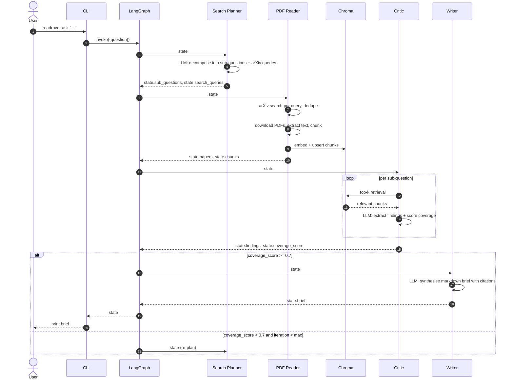

# ReadRover Architecture

## Why a graph, not a pipeline?

A pipeline would work for the happy path, but a graph lets the **Critic** detect weak coverage and re-trigger the **Search Planner** with refined queries. That conditional loop is the difference between "an LLM with steps" and "an actual agent."

## Sequence

## Key design decisions

### 1. State as a Pydantic model

Every node has a typed contract. No string-typed dicts floating around. Mistakes show up at validation time, not deep inside an LLM call.

### 2. Vector store keyed per-question

We create a fresh Chroma collection per question (`hash(question)` as the collection name). This avoids stale embeddings polluting later runs and keeps demo isolation simple. Production would key by `user_id + session_id`.

### 3. Sub-agent boundaries

Each sub-agent maps to one LLM-call concern:

| Agent | Concern |
|---|---|
| Search Planner | Question understanding |
| PDF Reader | Data acquisition (no LLM here — pure tool use) |
| Critic | Grounding + evaluation |
| Writer | Final synthesis |

This makes each agent independently testable, swappable, and traceable in LangSmith.

### 4. Conditional re-planning, bounded

`critic_router` can send us back to the planner — but `state.iteration` is hard-capped by `settings.max_iterations` so we never spin. This is a real-world agentic pattern: cheap retries with a budget, then graceful degradation.

### 5. Citations are first-class

The Writer is prompted to inline-cite as `[arxiv:1234.5678]` and `evals/run_eval.py:score_citation_validity` measures whether those IDs actually map to retrieved papers. Hallucinated citations are the #1 failure mode of research agents — we want a number to track this.

## Future work

- **Citation graph traversal** — when paper A cites paper B and B is highly cited within retrieved chunks, fetch B too (multi-hop).
- **Source diversification** — fall back to Semantic Scholar / Google Scholar when arXiv is thin.
- **User feedback loop** — capture 👍/👎 in the demo and use them to grow the eval set automatically.
