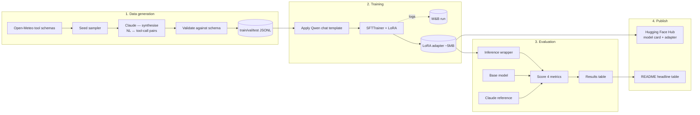

# ToolSmith Architecture

## End-to-end pipeline

## Why these choices

### Why Qwen2.5-0.5B-Instruct?
- Smallest current-gen *instruct* model with usable chat templating.
- Fits any free-tier GPU (Colab T4) with margin to spare.
- Demonstrates that competence can come from data + recipe, not just scale.

### Why LoRA over full fine-tuning?
- 5 MB of trainable params vs. 1 GB — fast iteration, cheap storage.
- Preserves base capabilities; the model still answers general chat reasonably.
- Industry-standard for adapter-based deployment.

### Why synthetic data over a public dataset?
- Tool-calling datasets that match Open-Meteo's exact schema don't exist.
- Synthesising lets us cover targeted edge cases (out-of-scope refusals, rare cities, typos) deliberately.
- Demonstrates the data-engineering side of ML, not just model training.

### Why a 4-axis evaluation?
- Single accuracy hides failure modes. Splitting into validity / schema / args / hallucination tells you *how* the model fails.
- Matches the way real teams triage tool-calling regressions.

## Reproducibility

- **Random seed** pinned in `settings.seed` (default 42).
- **Hyperparams** centralised in `config.Settings` — no magic numbers in `train.py`.
- **W&B run** linked from the README so reviewers can inspect curves directly.
- **Adapter + tokenizer** uploaded together to Hugging Face Hub.
